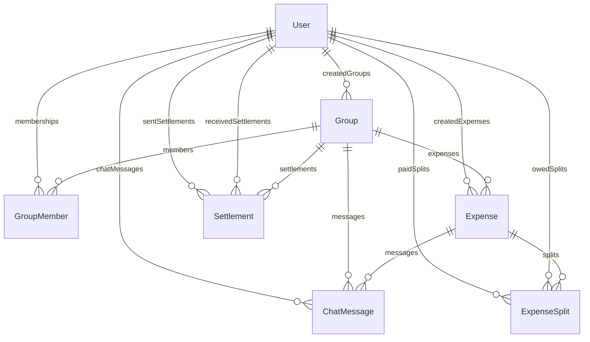

# SCOPE.md — Anomaly Log & Database Schema

This document catalogues every data quality issue detected in the Spreetail `expenses.csv` dataset, explains our programmatic resolution logic, and defines our relational database schema mappings.

---

## 1. CSV Data Anomaly Log

Below is the list of all anomalies identified in the CSV file and how our ingestion system resolves them dynamically.

| Row | Field | Original Value | Issue Description | Resolution Action taken |
|:---|:---|:---|:---|:---|
| **5** | `row` | `08-02-2026,dinner - marina bites,...` | Exact duplicate of Row 4 (date, payer, amount, splits match). | **Skipped row** to prevent double-charging members. |
| **6** | `amount` | `"1,200"` | Quoted string with comma formatting. | **Sanitized string** by removing quotes/commas, parsing to float `1200.00`. |
| **8** | `paid_by` | `priya` | Casing inconsistency (all lowercase). | **Normalized casing** to standard Title Case `Priya`. |
| **9** | `amount` | `899.995` | Too many decimal places (3 decimals). | **Rounded amount** to 2 decimal places: `900.00`. |
| **10** | `paid_by` | `Priya S` | Name variations/typo of existing user. | **Mapped name** to standard group user `Priya`. |
| **12** | `paid_by` | *(blank)* | Missing payer name ("can't remember who paid"). | **Assigned default payer** as first participant in the split list (`Aisha`). |
| **13** | `split_type` | *(blank)* | Settlement transaction logged in expense log. | **Imported as Settlement** (database `Settlement` table) from Rohan to Aisha, instead of a normal expense split. |
| **14** | `split_details` | `Aisha 30%; Rohan 30%; ...` | Percentages sum to `110%` instead of `100%`. | **Normalized percentages** proportionally so they sum to exactly `100%`. |
| **19** | `currency` | `540 USD` | Foreign currency (USD). | **Converted USD to INR** using fixed exchange rate `1 USD = 83 INR` (amount: `44820.00 INR`). |
| **20** | `currency` | `84 USD` | Foreign currency (USD). | **Converted USD to INR** at `83.0` rate (`6972.00 INR`). |
| **22** | `split_with` | `Dev's friend Kabir` | Guest user `Kabir` not present in base group. | **Auto-created system user** `Kabir` and enrolled them in the group. |
| **22** | `currency` | `150 USD` | Foreign currency (USD). | **Converted USD to INR** at `83.0` rate (`12450.00 INR`). |
| **24** | `description`| `Thalassa dinner` | Potential double-log / conflict (different payer/amount for Thalassa). | **Imported both entries** but logged warning about duplicate events for auditing. |
| **25** | `amount` | `-30 USD` | Negative refund transaction. | **Converted USD to INR** (`-2490.00 INR`) and imported splits as negative values (reducing debts). |
| **26** | `date` | `Mar-14` | Inconsistent date format (Month-Day). | **Parsed date** assuming sequence year `2026` (`14-03-2026`). |
| **26** | `paid_by` | `rohan ` | Trailing whitespace and lowercase casing. | **Cleaned & Normalized** to standard user name `Rohan`. |
| **27** | `currency` | *(blank)* | Missing currency ("forgot to set currency"). | **Defaulted currency** to base currency `INR`. |
| **30** | `amount` | `0` | Zero amount expense ("counted twice - fixing later"). | **Imported as zero-amount expense** to maintain transaction log history. |
| **31** | `split_details` | `Aisha 30%; Rohan 30%; ...` | Percentages sum to `110%` instead of `100%`. | **Normalized percentages** proportionally so they sum to exactly `100%`. |
| **33** | `date` | `04-05-2026` | Date ambiguity note ("is this April 5 or May 4?"). | **Parsed as May 4th** per DD-MM-YYYY format, flagged for manual checking. |
| **35** | `split_with` | `Meera` | Inactive member `Meera` split after leaving group. | **Imported split with Meera** as logged, marked warning about inactive participant. |
| **41** | `split_details` | `Aisha 1; Rohan 1; ...` | Redundant split details on an EQUAL split. | **Ignored split details** and distributed equally. |

---

## 2. Database Schema

The database uses PostgreSQL (managed via Prisma ORM) with a robust structure to support multi-payer splits, settlements, and live comments.

### Table Definitions

#### `User`
Tracks individual user identities and credentials.
* `id` (String, Primary Key): UUID.
* `name` (String): Full display name.
* `email` (String, Unique): User email address.
* `passwordHash` (String): Secure bcrypt password hash.
* `avatarUrl` (String, Optional): Link to generated profile picture.

#### `Group`
Stores groups of users sharing expenses.
* `id` (String, Primary Key): UUID.
* `name` (String): Group name.
* `description` (String, Optional): Brief details about the group.
* `avatarUrl` (String, Optional): Group display picture.
* `createdById` (String, Foreign Key): ID of the creator.

#### `GroupMember`
Enrolls users in groups (many-to-many lookup table).
* `id` (String, Primary Key): UUID.
* `groupId` (String, Foreign Key): Links to `Group`.
* `userId` (String, Foreign Key): Links to `User`.

#### `Expense`
Records the core data of a shared bill.
* `id` (String, Primary Key): UUID.
* `description` (String): Name of the purchase.
* `amount` (Float): Total cost in base currency (INR).
* `date` (DateTime): Date when transaction occurred.
* `category` (String): Billing category (e.g. Groceries, Lodging).
* `groupId` (String, Foreign Key): Group containing this expense.
* `createdById` (String, Foreign Key): User who created the log.

#### `ExpenseSplit`
Specifies individual splits of an expense (who paid what, who owes what).
* `id` (String, Primary Key): UUID.
* `expenseId` (String, Foreign Key): Links to `Expense`.
* `userId` (String, Foreign Key): Debtor who owes money.
* `owedAmount` (Float): Amount owed by this participant.
* `paidAmount` (Float): Amount paid by this participant.
* `paidById` (String, Foreign Key, Optional): Links to payer.

#### `Settlement`
Logs direct debt payments / payback transactions between group members.
* `id` (String, Primary Key): UUID.
* `groupId` (String, Foreign Key): Group containing the settlement.
* `fromUserId` (String, Foreign Key): Sender of the money.
* `toUserId` (String, Foreign Key): Recipient of the money.
* `amount` (Float): Total cash transferred.
* `date` (DateTime): Date of settlement.

#### `ChatMessage`
Logs real-time thread messages associated with individual expenses.
* `id` (String, Primary Key): UUID.
* `message` (String): Chat content.
* `userId` (String, Foreign Key): Sender of the message.
* `groupId` (String, Foreign Key): Group of the chat room.
* `expenseId` (String, Foreign Key, Optional): Specific expense thread context.
